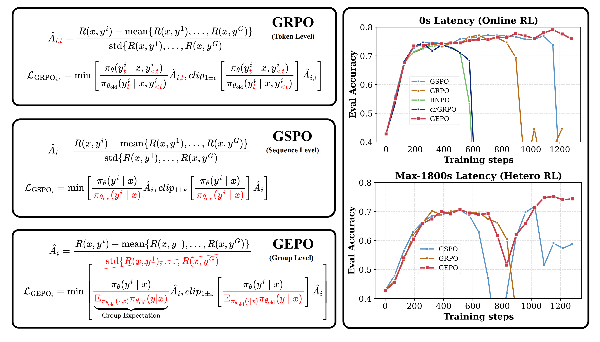

<div align="center">

<h2>Hetero RL: Heterogeneous Reinforcement Learning</h2></div>
</div>


  
<p align="center">
  <a href="https://arxiv.org/abs/2508.17850">
    
  </a>
</p>


<h4>HeteroRL supports a growing family of advanced RL algorithms for LLM training:</h4></div>

<div align="center">

<a href="https://arxiv.org/abs/2506.02864" target="_blank">BNPO</a> ｜

<a href="https://arxiv.org/abs/2503.20783" target="_blank">Dr. GRPO</a> ｜

<a href="https://arxiv.org/abs/2508.17850" target="_blank">GEPO*</a> ｜

<a href="https://arxiv.org/abs/2507.20673" target="_blank">GMPO</a> ｜

<a href="https://arxiv.org/abs/2402.03300" target="_blank">GRPO</a> ｜

<a href="https://arxiv.org/abs/2507.18071" target="_blank">GSPO</a> ｜

<a href="https://arxiv.org/abs/2509.07558" target="_blank">VL Norm</a> ｜

<a href="https://arxiv.org/abs/2506.13585" target="_blank">CISPO</a> ｜

<a href="https://arxiv.org/abs/2503.14286" target="_blank">TOPR</a> ｜

<a href="https://arxiv.org/abs/1802.01561" target="_blank">IMPALA</a>
</div>

---

**HeteroRL** is a novel heterogeneous reinforcement learning framework designed for **stable and scalable training of large language models (LLMs) in geographically distributed, resource-heterogeneous environments**. Traditional RL methods tightly couple rollout generation and policy updates, making them fragile under real-world network latency and hardware diversity. HeteroRL decouples these phases, enabling independent operation of sampler and learner nodes connected over the Internet.

At its core, HeteroRL introduces **Group Expectation Policy Optimization (GEPO)**, an algorithm that replaces fragile token- or sequence-level importance weights with robust **group-level expectation weights**. This innovation exponentially reduces the variance of importance sampling under high policy divergence (caused by latency), ensuring stable training even with delays up to 1800 seconds. Experiments show GEPO achieves state-of-the-art performance and dramatically improved stability—reducing the best-to-last performance gap by 85% compared to prior methods—making it ideal for decentralized, wide-area LLM fine-tuning.

<details open>
<summary>📢 <strong> BREAKING: GEPO — The Algorithm That Makes Decentralized AI Training Possible!</strong></summary>

<br>

<h2 align="center">✨ GEPO: Group Expectation Policy Optimization for Heterogeneous RL</h2>

📅 **Release Date**: Aug 25, 2025 (arXiv)  
📄 **Paper**: [Group Expectation Policy Optimization for Heterogeneous Reinforcement Learning](https://arxiv.org/abs/2508.17850)  
🧑‍💻 **Authors**: Pengcheng Lab / Heterogeneous Large Model Research Team

---

### ⚡ Why It Matters

Training giant AI models now requires global, decentralized compute. But network delays cause “policy staleness,” making traditional RL algorithms (like GRPO, GSPO) **crash** due to exploding gradient variance.

**GEPO solves this.** By replacing unstable per-token weights with **Group Expectation Importance Weighting**, it exponentially reduces variance under high latency — enabling stable training even with **1800-second delays**.

✅ **Theoretically Proven**: Exponentially reduces importance sampling variance (Theorem 1).  
✅ **Extremely Robust**: Only **3% performance drop** under extreme 1800s latency.  
✅ **Plug-and-Play**: Easy to integrate — modifies only the importance weight calculation.  
✅ **Better Everywhere**: Outperforms GRPO/GSPO even in zero-delay (online) settings.

> 📊 **Key Results (Qwen3-1.7B)**:
> - **Zero-Delay**: GEPO Last = **41.4** vs. GSPO Last = **24.3** (+17.1 gain).  
> - **High-Delay (64 steps)**: GEPO Last = **43.5** (no drop) vs. GSPO Last = **20.9**.  
> - **Extreme Test (1800s)**: Performance degradation **< 3%**.

---
### 📋 Full Benchmark Comparison

| Method          | AMC2023     | AIME2024    | AIME2025    | MATH500     | Average     |
|-----------------|-------------|-------------|-------------|-------------|-------------|
|                 | Best / Last | Best / Last | Best / Last | Best / Last | Best / Last |
| **Qwen3-1.7B**  | 25.6 / —    | 1.6 / —     | 3.9 / —     | 54.7 / —    | 21.5 / —    |
|                 |             |             |             |             |             |
| **Max Delay = 0 (Online RL)** |             |             |             |             |             |
| BNPO            | 54.3 / 0.0  | 18.4 / 0.0  | 19.1 / 0.0  | 78.7 / 0.0  | 42.6 / 0.0  |
| Dr.GRPO         | 53.4 / 14.3 | 19.1 / 1.6  | 18.8 / 2.0  | 78.6 / 35.9 | 42.5 / 13.5 |
| GRPO            | 56.3 / 23.4 | 20.7 / 0.4  | 19.9 / 2.3  | 79.8 / 49.7 | 44.2 / 19.0 |
| GSPO            | 54.1 / 27.8 | **23.8** / 3.1 | **20.7** / 4.3 | 79.9 / 62.1 | 44.6 / 24.3 |
| **GEPO (Ours)** | **56.9** / **56.9** | 21.9 / **16.4** | 20.3 / **14.1** | **80.4** / **78.1** | **44.9** / **41.4** |
|                 |             |             |             |             |             |
| **Max Delay = 64 (Hetero RL)** |             |             |             |             |             |
| BNPO            | 45.0 / 43.1 | 12.1 / 11.3 | 12.5 / 10.1 | 71.1 / 69.3 | 35.2 / 33.5 |
| Dr.GRPO         | 48.4 / 48.4 | 17.2 / 17.2 | 14.8 / 14.8 | 73.9 / 73.9 | 38.6 / 38.6 |
| GRPO            | 46.6 / 46.6 | 19.1 / 14.5 | 14.8 / 14.8 | 74.9 / 74.9 | 38.9 / 37.7 |
| GSPO            | **54.4** / 23.8 | 17.6 / 1.6  | 17.6 / 2.7  | 78.2 / 55.6 | 41.9 / 20.9 |
| **GEPO (Ours)** | 53.8 / **53.8** | **21.9** / **21.9** | **18.8** / **18.8** | **79.6** / **79.6** | **43.5** / **43.5** |

---


### 🧠 The Core Idea: Think Groups, Not Tokens

Traditional methods use `p(y|x) / q(y|x)`, which explodes when `q(y|x)` is small. GEPO’s genius is simple:

**Group Expectation Weight:**
`w_GEPO(y|x) = p(y|x) / Ê_q[q(y|x)]`

Where `Ê_q[q(y|x)]` is estimated from a group of responses `{y1...yG}` for the same prompt `x`:
`Ê_q[q(y|x)] ≈ Σ(q(yi|x)²) / Σ(q(yi|x))`

This group-level denominator **smooths out wild fluctuations**, preventing gradient explosions and keeping training stable — no matter how stale the data is.



> **Figure 1**: GEPO improves upon GRPO and GSPO by employing **group-level importance weights** to enhance training stability. It demonstrates superior performance in both **zero-delay (online)** and **high-delay (up to 1800s)** heterogeneous RL scenarios.

---

### 🚀 The Future: Decentralized AI is Here

GEPO is the engine of **HeteroRL**, a framework that decouples sampling and learning across global nodes. This isn’t just an algorithm — it’s the foundation for community-driven, globally distributed AI training.

> 💡 **Pro Tip**:  
> - Use GEPO as your **default RL algorithm** — it’s more stable everywhere.  
> - For maximum robustness in production, combine it with the “Defensive Sampling” mechanism (Appendix F).

</details>

---


<details>
<summary>📢 <strong>Coming Soon(🧠): SAPC — Staleness-Aware Policy Calibration!</strong></summary>

<br>

<h2 align="center">✨ SAPC: Smooth Staleness-Aware Correction for Asynchronous LLM RL</h2>

📅 **Release Date**: Coming Soon  
📄 **Paper**: Coming Soon  
🧑‍💻 **Authors**: Coming Soon  
🔗 **Implementation**: Coming soon in HeteroRL; compatible with asynchronous actor–learner and GRPO-style RL pipelines

---

### ⚡ Why It Matters

In scalable LLM RL, rollout generation and learner updates are often decoupled, making **stale-policy updates** unavoidable.  
Raw importance ratios can explode under long autoregressive sequences, while PPO/GRPO-style clipping is static and does not consider how stale a sample actually is.

SAPC addresses this by replacing hard clipping with a **smooth staleness-aware calibrated importance weight**. It contracts unreliable stale ratios toward the neutral point while preserving useful learning signals from fresher samples.

✅ **Staleness-aware** – adapts correction strength using learner–sampler lag  
✅ **Smooth calibration** – avoids discontinuous hard clipping  
✅ **Closed-form coefficient** – derived with a Lambert-W based solution  
✅ **Token-level & sequence-level variants** – supports both SAPC-token and SAPC-seq  
✅ **Drop-in integration** – easy to plug into GRPO-style asynchronous learners  

> 💡 **Pro Tips**:  
> - Use **SAPC-token** as the default for token-level RL training  
> - Use logarithmic learner–sampler lag as the staleness signal  
> - Tune `staleness_strength` to control calibration intensity  
> - Especially useful for replay, mini-batch reuse, async rollout queues, and off-policy LLM RL

</details>

<details>
<summary>📢 <strong>Nov 20 Update(🖱️): Added Implementation of CISPO — Clipped IS-weight Policy Optimization!</strong></summary>

<br>

<h2 align="center">✨ Clipped IS-weight Policy Optimization (CISPO): Stable & Efficient RL without Token Clipping</h2>

📅 **Release Date**: Jun 16, 2025 (arXiv)  
📄 **Paper**: [MiniMax-M1: Scaling Test-Time Compute Efficiently with Lightning Attention](https://arxiv.org/abs/2506.13585)  
🧑‍💻 **Authors**: MiniMax AI Team  
🔗 **Implementation**: Integrated into HeteroRL; compatible with hybrid-attention and long-context models

---

### ⚡ Why It Matters
Traditional PPO/GRPO-style algorithms **clip token-level policy updates** to enforce trust-region constraints. However, this inadvertently **discards critical low-probability tokens** (e.g., reasoning “forks” like *“Wait”*, *“Recheck”*) that are essential for exploration and scalable reasoning.  
CISPO resolves this by **clipping the importance sampling (IS) weights** instead of the token updates, preserving **gradient signal from all tokens** while stabilizing off-policy training.

✅ **No dropped tokens** – critical rare tokens remain learnable  
✅ **Lower training variance** via bounded IS weights  
✅ **Faster convergence**: **2× speedup** over DAPO on math RL tasks  
✅ **Plug-and-play**: drop-in replacement for GRPO/DAPO in token-level RL setups

> 💡 **Pro Tips**:  
> - Use **asymmetric clipping**: typically only upper-bound IS weights (e.g., `clip(·, 0, 1+ε)` with `ε=0.2–0.4`)  
> - Combine with **group-relative advantage normalization** (as in GRPO) for stable reward scaling  
> - Avoid KL penalties — CISPO is designed to be **KL-free** and more compute-efficient  
> - Ideal for **long CoT** and **hybrid-attention architectures** where token survival is crucial

</details>

<details>
<summary>📢 <strong>Nov 19 Update(🖱️): Added Implementation of TOPR — Tapered Off-Policy REINFORCE!</strong></summary>

<br>

<h2 align="center">✨ Tapered Off-Policy REINFORCE (TOPR): Stable & Efficient Off-Policy RL for LLMs</h2>

📅 **Release Date**: Mar 20, 2025 (arXiv)  
📄 **Paper**: [Tapered Off-Policy REINFORCE](https://arxiv.org/abs/2503.14286)  
🧑‍💻 **Authors**: Nicolas Le Roux, Marc G. Bellemare, Jonathan Lebensold, et al. (Mila & Reliant AI)  
🔗 **Implementation**: Integrated into HeteroRL with native support for negative examples and asynchronous rollout datasets

---

### ⚡ Why It Matters
Standard REINFORCE collapses in off-policy settings due to **unbounded negative updates**, while many popular methods (e.g., PPO, DPO) either **discard negative examples** or **suffer from limited off-policy capability**.  
TOPR resolves this with an **asymmetric, tapered importance sampling** scheme that:

✅ **Stably leverages both positive and negative examples** without KL regularization  
✅ **Accelerates learning on rare positives** via SFT-style updates (clipping lower bound = 1)  
✅ **Prevents destructive updates from negatives** via truncated importance ratios (clipping lower bound = 0)  
✅ **Matches 70B-model performance with only 8B parameters** through iterative dataset curation (e.g., Anna Karenina sampling)

> 💡 **Pro Tips**:  
> - **Always keep negative examples** — they dramatically improve data efficiency and reduce “wasted inference.”  
> - Tune the **baseline parameter** not for variance reduction, but to **control effective positive ratio** (~10–20% is optimal).  
> - Combine TOPR with **dynamic dataset balancing** (e.g., favoring hard negatives) for multi-iteration gains.  
> - Avoid gradient clipping values >1.0 unless using ratio truncation — standard IS can explode on skewed datasets.

</details>
<details>
<summary>📢 <strong>Sep 26 Update(🖱️): Added Implementation of GMPO — Geometric-Mean Policy Optimization!</strong></summary>

<br>

<h2 align="center">✨ Geometric-Mean Policy Optimization (GMPO): Stabilizing GRPO with Outlier-Robust Aggregation</h2>

📅 **Release Date**: Jul 28, 2025 (arXiv)  
📄 **Paper**: [Geometric-Mean Policy Optimization](https://arxiv.org/abs/2507.20673)  
🧑‍💻 **Authors**: Yuzhong Zhao, Yue Liu (UCAS), Junpeng Liu (CUHK), Jingye Chen (HKUST), and Microsoft Research Team  
🔗 **Implementation**: Based on [GMPO](https://github.com/callsys/GMPO)

---

### ⚡ Why It Matters
GRPO optimizes the **arithmetic mean** of token-level rewards, which is highly sensitive to **outlier importance-weighted rewards**, causing unstable policy updates and extreme importance sampling ratios.  
GMPO addresses this by switching to the **geometric mean**, which is inherently **robust to outliers** and leads to:

✅ **Stable importance sampling ratios** (narrower range, fewer extremes)  
✅ **Lower training variance** and **more reliable gradients**  
✅ **Enhanced exploration** via wider clipping (e.g., `(e⁻⁰·⁴, e⁰·⁴)`) without sacrificing stability  
✅ **Consistent gains**: **+4.1%** on math benchmarks and **+1.4%** on multimodal reasoning (Geometry3K)

> 💡 **Pro Tips**:  
> - Use **token-level clipping** (not sequence-level) for finer gradient control.  
> - Set clipping range to `(e⁻⁰·⁴, e⁰·⁴)` to balance exploration and stability.  
> - GMPO maintains **higher token entropy** and **lower KL divergence** from the pre-RL model — ideal for scalable RL training.

</details>

<details>
<summary>📢 <strong> Sep 17 Update(🖱️): Added Implementation of ∆L Normalization — Unbiased & Minimum-Variance!</strong></summary>

<br>

<h2 align="center">✨ ∆L Normalization: Rethink Loss Aggregation in RLVR</h2>

📅 **Release Date**: Sep 9, 2025 (arXiv)  
📄 **Paper**: [∆L Normalization: Rethink Loss Aggregation in RLVR](https://arxiv.org/abs/2509.07558)  
🧑‍💻 **Authors**: Zhiyuan He, Xufang Luo (Microsoft Research), Yike Zhang (Tsinghua), et al.  
🔗 **Implementation**: Based on [Delta-L-Normalization](https://github.com/zerolllin/Delta-L-Normalization)

---

### ⚡ Why It Matters
In RLVR, response lengths vary dramatically — leading to **high gradient variance** and **biased updates** in existing methods (GRPO, DAPO, Dr. GRPO).  
∆L Normalization solves both:

✅ **Unbiased estimator** of true policy gradient  
✅ **Theoretically minimal variance** (when `α=1`)  
✅ **Plug-and-play** — <10 lines to integrate

> 💡 **Pro Tip**:  
> - Use `α=1` for **minimum variance** (default, stable training).  
> - Use `α=0.75` for **Math tasks** — better utilization of long, informative responses.

</details>


<details>
<summary>📢 <strong>Update: Added Implementation of GSPO — Stable, Efficient & MoE-Friendly!</strong></summary>

<br>

<h2 align="center">✨ GSPO: Group Sequence Policy Optimization for Scalable RL</h2>

📅 **Release Date**: July 28, 2025 (arXiv v2)  
📄 **Paper**: [**Group Sequence Policy Optimization**](https://arxiv.org/abs/2507.18071)  
🧑‍💻 **Authors**: Chujie Zheng, Shixuan Liu, Mingze Li, Bowen Yu, et al. (Qwen Team, Alibaba)  

---

### ⚡ Why It Matters
Existing methods like **GRPO** suffer from **catastrophic instability** when scaling to large models — especially **MoE architectures** — due to noisy token-level importance ratios.  
**GSPO fixes this at the root**:

✅ **Sequence-level importance weights** — Matches reward granularity & reduces variance  
✅ **Stable MoE training** — No “Routing Replay” hacks needed 🚫  
✅ **Higher training efficiency** — Achieves better performance with same compute  
✅ **Simpler infrastructure** — Compatible with inference-engine likelihoods (no recompute needed)

> 💡 **Pro Tip**:  
> - Use `clip_range=(3e-4, 4e-4)` for optimal stability (default in Qwen3 RL training).  
> - For multi-turn RL, try **GSPO-token** variant — enables per-token advantage while preserving sequence-level stability.

</details>


<details>
<summary>📢 <strong>Update: Added Implementation of Dr. GRPO — Unbiased & Token-Efficient!</strong></summary>

<br>

<h2 align="center">✨ Dr. GRPO: Group Relative Policy Optimization Done Right</h2>

📅 **Release Date**: March 26, 2025 (arXiv)  
📄 **Paper**: [**Understanding R1-Zero-Like Training: A Critical Perspective**](https://arxiv.org/abs/2503.20783)  
🧑‍💻 **Authors**: Zichen Liu, Changyu Chen, Wenjun Li, et al. (Sea AI Lab, NUS, SMU)

---

### ⚡ Why It Matters
Original **GRPO** introduces **length bias** and **difficulty bias** — artificially inflating response lengths (especially for *incorrect* answers) and skewing updates toward “easier” questions.  
**Dr. GRPO removes these biases at the source**:

✅ **Unbiased gradient estimator** — Faithfully implements true policy gradient objective  
✅ **Token-efficient training** — Prevents wasteful generation of long, incorrect responses 🚫📏  
✅ **Plug-and-play replacement** — Drop-in substitute for GRPO with minimal code change  
✅ **Preserves reasoning performance** — Matches or exceeds GRPO’s final accuracy with less compute

> 💡 **Pro Tip**:  
> - Use Dr. GRPO when you want **stable length growth** (only for correct reasoning, not noise).  
> - Combine with **∆L Normalization** for double variance reduction + unbiasedness.

</details>

<details>
<summary>📢 <strong>Update: Added Implementation of BNPO — Adaptive, Low-Variance & Generalizes GRPO!</strong></summary>

<br>

<h2 align="center">✨ BNPO: Beta Normalization Policy Optimization for Stable RL Training</h2>

📅 **Release Date**: June 3, 2025 (arXiv)  
📄 **Paper**: [**BNPO: Beta Normalization Policy Optimization**](https://arxiv.org/abs/2506.02864)  
🧑‍💻 **Authors**: Changyi Xiao, Mengdi Zhang, Yixin Cao (Fudan University, Meituan)  

---

### ⚡ Why It Matters
Current RL methods like **GRPO** and **REINFORCE** use **static reward normalization** — fixed throughout training — which fails to adapt to the evolving policy distribution, leading to unstable gradients and suboptimal convergence.  
**BNPO solves this with dynamic, theoretically grounded normalization**:

✅ **Adaptive Beta normalization** — Parameters `(α, β)` update dynamically with policy evolution  
✅ **Proven variance reduction** — Theoretically minimizes gradient variance under binary rewards  
✅ **Generalizes GRPO & REINFORCE** — Reduces to them under specific `(α, β)` settings  
✅ **Handles complex rewards** — Via novel *Advantage Decomposition* mechanism

> 💡 **Pro Tip**:  
> - BNPO automatically sets `α = (1+a)/3`, `β = (1+b)/3` — no manual tuning needed.  
> - Use Advantage Decomposition when combining multiple reward signals (e.g., accuracy + format).

</details>


---


## 🧠 Importance Weight Computation (Policy Optimization Methods)

```python
# Token-level importance ratio (e.g., GRPO, Dr. GRPO, BNPO)
if self.loss_type in ["grpo", "dr_grpo", "bnpo"]:
    coef_1 = learner_token_p / sampler_token_p

# Sequence-level importance ratio (GSPO)
elif self.loss_type == "gspo":
    coef_1 = learner_seq_p / sampler_seq_p

# Group-level importance ratio (GEPO — Ours)
elif self.loss_type == "gepo":
    normalized_q = sampler_seq_p.detach() / sampler_seq_p.sum().detach()
    coef_1 = learner_seq_p / (normalized_q * sampler_seq_p).sum()
```

> 📌 **Note**: GEPO computes importance weights at the **group level**, stabilizing training under heterogeneous sampling delays.

---

## ⚙️ Heterogeneous Reinforcement Learning Setup

> 📁 Enter the project directory first. Adjust paths in scripts if your directory differs.

### Environment Setup

```bash
conda create -n hetero-rl python=3.10.16
conda activate hetero-rl
cd ./Hetero-RL
pip install -r requirements.txt
```


### 1️⃣ Launch the Learner (4×A100 80GB)

```bash
cd ./Hetero-RL
CUDA_VISIBLE_DEVICES=0,1,2,3 bash sh_dir/HeteroRL_Learner_4gpus.sh learner_script_checkpoint GEPO_think_1th 1 v6b gepo 1L2S_GEPO_diff32_think
```

### 2️⃣ Launch Samplers (Run in Sequence)

> 🔄 To resume from checkpoint: Set `model_name_or_path` to your checkpoint path.

```bash
# Launch 4 sampler processes in background
bash sh_dir/HeteroRL_Sampler_4gpus.sh sampler_script_checkpoint GEPO_think_1th v6b gepo 1L2S_GEPO_diff32_think 0 &
bash sh_dir/HeteroRL_Sampler_4gpus.sh sampler_script_checkpoint GEPO_think_1th v6b gepo 1L2S_GEPO_diff32_think 1 &
bash sh_dir/HeteroRL_Sampler_4gpus.sh sampler_script_checkpoint GEPO_think_1th v6b gepo 1L2S_GEPO_diff32_think 2 &
bash sh_dir/HeteroRL_Sampler_4gpus.sh sampler_script_checkpoint GEPO_think_1th v6b gepo 1L2S_GEPO_diff32_think 3 &
```

---

## 🌐 Online Reinforcement Learning (4×A100 80GB)

Supports multiple policy optimization methods:
- [`GRPO`](https://arxiv.org/abs/2402.03300): DeepSeekMath: Pushing the Limits of Mathematical Reasoning in Open Language Models
- [`BNPO`](https://arxiv.org/abs/2506.02864): Beta Normalization Policy Optimization
- [`Dr.GRPO`](https://arxiv.org/abs/2503.20783): Understanding R1-Zero-Like Training: A Critical Perspective
- [`GSPO`](https://arxiv.org/abs/2507.18071): Group Sequence Policy Optimization
- [`GMPO`](https://arxiv.org/abs/2507.20673):  Geometric-Mean Policy Optimization 
- [`VL Norm`](https://arxiv.org/abs/2509.07558): Rethink Loss Aggregation in RLVR
- [**`GEPO`**](https://arxiv.org/abs/2508.17850): Group Expectation Policy Optimization (ours)  👈

```bash
cd ./Hetero-RL
CUDA_VISIBLE_DEVICES="0,1,2,3" MASTER_PORT=29510 bash sh_dir/Online_gXpo_4gpus.sh gepo
```

---

## 📚 Citation

If you use **GEPO** or find this code helpful, please cite:

```bibtex
@misc{gepo2025,
  title     = {Group Expectation Policy Optimization for Heterogeneous Reinforcement Learning},
  author    = {Han Zhang and Ruibin Zheng and Zexuan Yi and Zhuo Zhang and Hanyang Peng and Hui Wang and Zike Yuan and Cai Ke and Shiwei Chen and Jiacheng Yang and Yangning Li and Xiang Li and Jiangyue Yan and Yaoqi Liu and Liwen Jing and Jiayin Qi and Ruifeng Xu and Binxing Fang and Yue Yu},
  year      = {2025},
  eprint    = {2508.17850},
  archivePrefix = {arXiv},
  primaryClass = {cs.LG},
  url       = {https://arxiv.org/abs/2508.17850}
}
```

